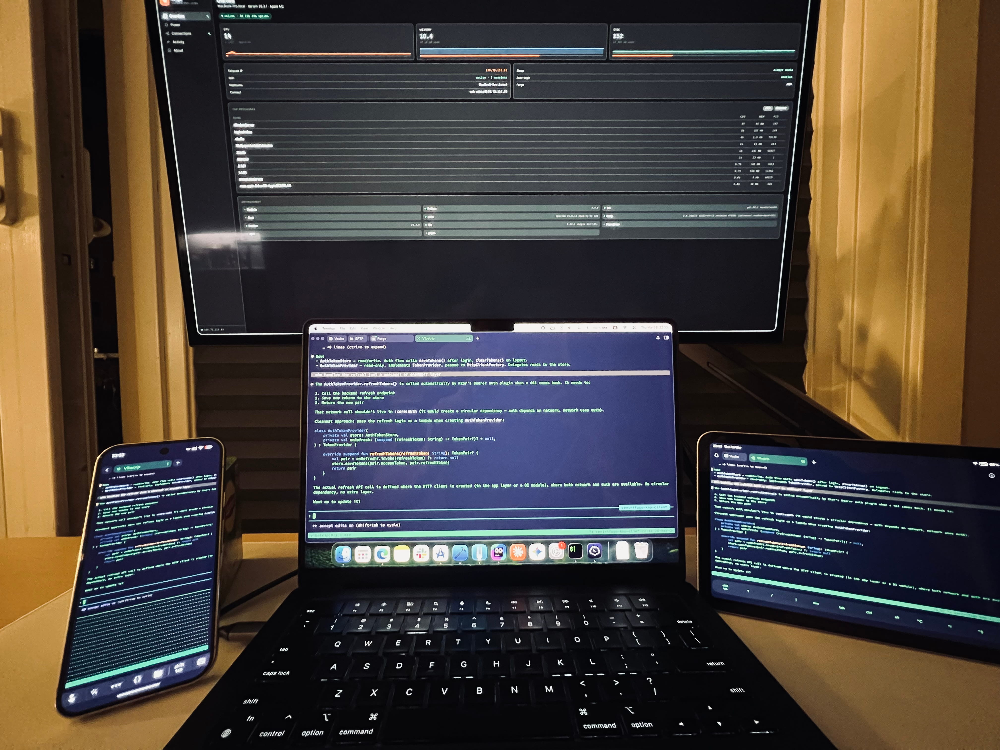
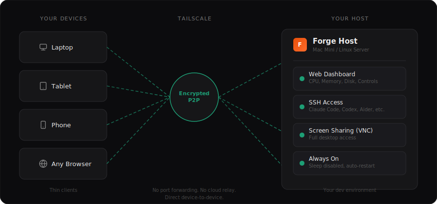
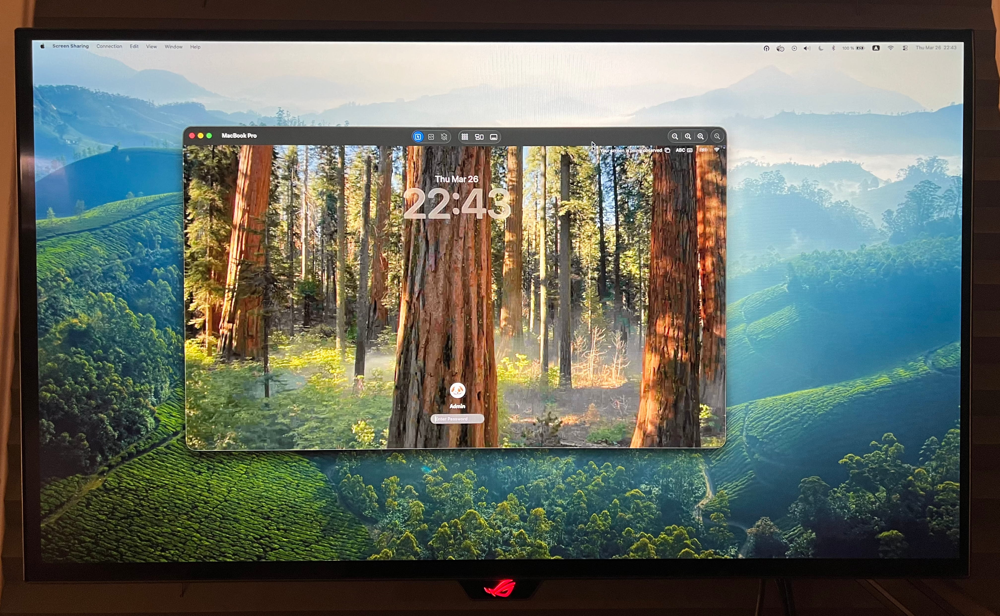
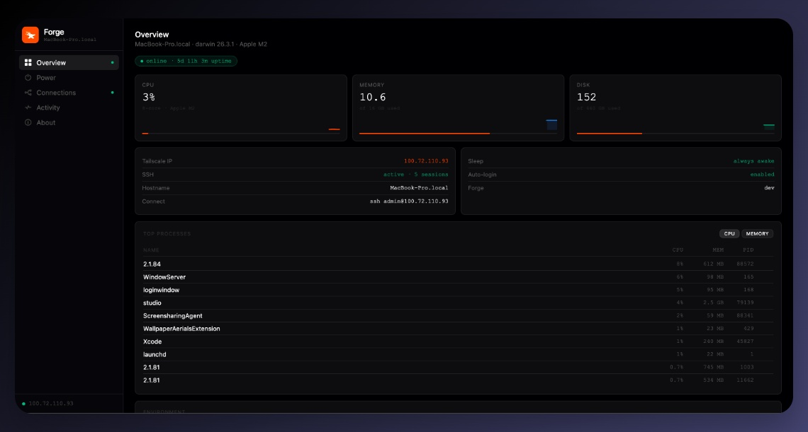

<p align="center">
  
</p>

<h1 align="center">Forge</h1>

<p align="center">
  Forge is a one-command setup tool that turns any Mac or Linux machine into a permanent, always-on development host — accessible from any device, anywhere.
</p>

<p align="center">
  <a href="#install">Install</a> · <a href="#getting-started">Getting Started</a> · <a href="#how-it-works">How it works</a> · <a href="#features">Features</a> · <a href="#why-tailscale">Why Tailscale</a>
</p>

---

<p align="center">
  
</p>

## 😫 Close the Lid. Lose the Flow.

Your dev environment is tied to a single device. Close the lid and you lose the session, the running agent, the build. Your tablet and phone are powerful devices with no dev host to connect to.

Forge turns any Mac or Linux box into an always-on dev host. Install it on a Mac Mini under your desk, a Mac Studio, a Linux box you already own. That machine never sleeps. The agent keeps running when you walk away. Your tmux sessions stay warm. Your builds finish.

From any device — laptop, tablet, phone — you SSH in and **re-attach**. Not resume. Your terminal is exactly where you left it.

## How it works

<p align="center">
  
  <br>
  <em>Your devices become thin clients. Your host does the work — whether you're watching or not.</em>
</p>

Forge installs a daemon on your host machine that:
- Keeps the machine awake and accessible
- Serves a web dashboard for monitoring and control
- Manages SSH, screen sharing, sleep, and power settings

Connection is handled by [Tailscale](https://tailscale.com) — a free, zero-config VPN that creates a secure peer-to-peer tunnel between your devices. No port forwarding, no dynamic DNS, no cloud relay. Data flows directly between your devices.

From any device on your Tailscale network, you SSH into the host and work inside a tmux session. Close your laptop, switch to your phone, open a different machine — `tmux attach` and you're back in the same session. The agent is still running. The build is still going. Nothing was interrupted.

### Why not OpenClaw?

OpenClaw lets you control an AI agent through Telegram, WhatsApp, or Slack. That's useful for automation — but it's not a dev environment. You're sending messages to a chatbot, not working in your terminal. Forge gives you your actual shell, your tmux sessions, your tools. You SSH in and work — no messenger in the middle.

### Why not a VPS?

A VPS works, but you're paying monthly rent for something a machine under your desk already does. With Forge you get local network speeds, Apple Silicon performance, no vendor limits on disk or RAM, and your files never leave your hardware. No ongoing cost — just the hardware you already own.

## Install

```bash
curl -fsSL https://sultan1993.github.io/Forge/install.sh | sh
```

The installer asks for your password once upfront, then:
- Detects your current setup and skips what's already configured
- Enables SSH and disables sleep (if not already done)
- Installs and connects Tailscale (if not already installed)
- Installs the Forge daemon and menu bar icon
- Prints your dashboard URL

Already have Tailscale and SSH configured? The installer skips straight to installing the daemon. Takes seconds.

## Getting Started

Once Forge is running, your workflow looks like this:

1. **SSH into your host** from any device on your Tailscale network:
   ```bash
   ssh user@100.x.x.x
   ```
   Use [Termius](https://termius.com), [Blink Shell](https://blink.sh), or any SSH client — including from your phone or tablet.

2. **Start a tmux session** so your work persists even if you disconnect:
   ```bash
   tmux new -s work
   ```
   Reconnect later from any device with `tmux attach -t work` and everything is exactly where you left it.

3. **Run your tools** — Claude Code, Codex, Aider, builds, servers — they all run on the host. Your device is just a window into the session.

4. **Monitor from the dashboard** — open `http://<tailscale-ip>:8080` in any browser to check CPU, memory, processes, and manage system settings.

5. **Screen share when you need a GUI** — enable VNC from the dashboard and connect with any VNC client. Full desktop access to your host, from anywhere.

   <p align="center">
     
     <br>
     <em>Screen sharing into the host from another device.</em>
   </p>

That's it. Your host does the heavy lifting. Your devices just connect.

## Features

### Web Dashboard

Access `http://<tailscale-ip>:8080` from any device on your Tailscale network.

<p align="center">
  
</p>

**Overview** — CPU, memory, and disk with live sparkline charts. Top processes with CPU/memory sort and kill button. Installed dev tools. Uptime, Tailscale IP, SSH status, and a one-click copy SSH command.

**Power** — Toggle sleep prevention (system, display, disk). Wake-on-LAN with MAC address display. Power schedule for automatic daily sleep/wake. Auto-login toggle. Restart and shutdown with confirmation.

**Connections** — Toggle SSH and screen sharing (VNC). Active SSH sessions with user, source IP, and duration. Tailscale device list with online status. VNC server install button for Linux hosts.

**Activity** — Timestamped log of all actions: connections, toggle changes, restarts, updates. Stored to disk, auto-rotates weekly.

**About** — Version display, check for updates with one-click upgrade, uninstall.

### Menu Bar Icon

A lightweight tray app that lives in your menu bar:
- **Open Dashboard** — launches the web UI
- **Auto-start on login** — toggle to start Forge on boot
- **Quit Forge** — stops the daemon

### Always On

Forge keeps your machine ready:
- Sleep disabled by default
- Daemon auto-restarts via launchd (macOS) or systemd (Linux)
- Wake-on-LAN support for recovery
- Optional power schedule (sleep at midnight, wake at 6am)
- Auto-login after power loss (macOS, opt-in)

### Auto-Update

Check for updates from the dashboard. One click downloads the new version, replaces the binaries, and restarts the daemon. No manual steps.

## Why Tailscale?

Forge uses [Tailscale](https://tailscale.com) to create a secure private network between your devices. This gives you:

- **Access from anywhere** — laptop, phone, tablet, any network
- **No port forwarding** — works behind NAT, firewalls, hotel Wi-Fi
- **Peer-to-peer** — data flows directly between devices, not through a server
- **Encrypted** — WireGuard encryption on every connection
- **Zero config** — install, sign in, done

The Forge dashboard binds to your Tailscale IP only — it's never accessible from the public internet. Tailscale network membership is the authentication layer.

Tailscale is free for personal use (up to 100 devices).

## Platform Support

| | macOS | Linux |
|---|---|---|
| **Versions** | macOS 13+ (Ventura) | Ubuntu 20.04+, Debian 11+, Fedora 36+ |
| **Architectures** | Apple Silicon, Intel | x86_64 |
| **Daemon** | launchd | systemd |
| **Menu bar icon** | Native systray | GTK systray |
| **Screen sharing** | Built-in VNC | TigerVNC / x11vnc (auto-detected or installable) |
| **Wake-on-LAN** | pmset | ethtool |
| **Auto-login** | Supported (FileVault check) | Not supported |

## Uninstall

From the web dashboard (About → Uninstall Forge) or from the terminal:

```bash
forge-host uninstall
```

Removes the daemon, tray app, and config. Does **not** touch Tailscale, SSH, or sleep settings — those are yours.

## Development

```bash
# Build both binaries
make build

# Run the daemon locally
make run

# Cross-compile for all platforms
make release

# Clean build artifacts
make clean
```

### Project Structure

```
forge/
├── cmd/
│   ├── forge-host/         # Daemon (REST API + embedded web UI)
│   └── forge-host-tray/    # Menu bar icon
├── internal/
│   ├── api/                # HTTP handlers (power, connections, processes, etc.)
│   ├── config/             # Config file loader
│   ├── system/             # Platform-specific ops (macOS + Linux)
│   ├── tailscale/          # Tailscale status and device list
│   └── web/                # Embedded static files (dashboard HTML/CSS/JS)
├── docs/                   # Specs and admin page
├── assets/                 # Logo, screenshots, diagram
├── .github/workflows/      # CI/CD (release)
├── install.sh              # Interactive installer
├── go.mod
├── Makefile
└── LICENSE
```

## License

MIT — see [LICENSE](LICENSE).

---

<p align="center">
  Built with <a href="https://claude.ai/code">Claude Code</a>
</p>
